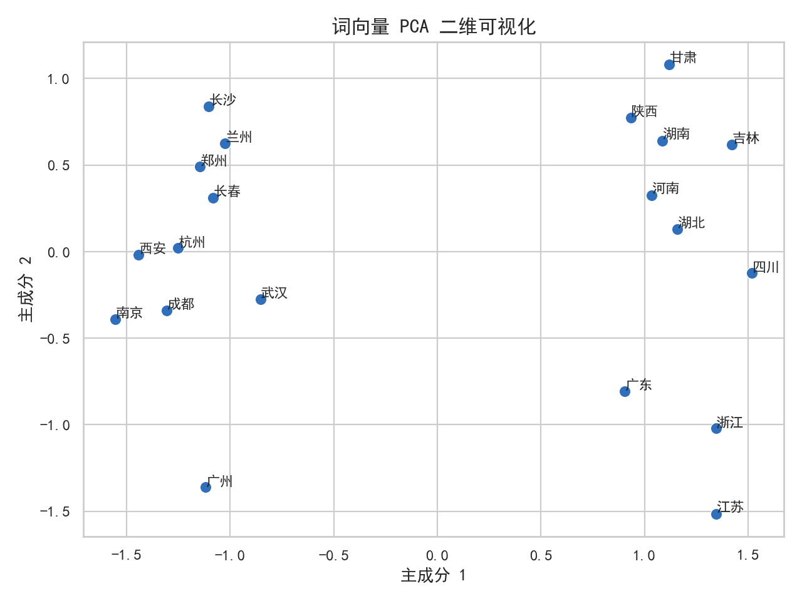

# 实验一：中文词向量

## 摘要

本实验面向大规模中文语料构建词向量表示。首先使用 Jieba 完成分词和标点过滤，然后采用 Skip-gram 架构训练 100 维 Word2Vec 模型，最后通过余弦相似度、近邻词检索、词向量类比和 PCA 降维考察模型学习到的语义结构。实验共处理 818,010 行文本和 5,590,263 个 token，得到包含 190,850 个词的词表。结果显示，城市、国家和地域词能够形成较明显的语义邻域，但线性类比与二维投影仍受到语料分布和降维信息损失的限制。

## 1. 实验目的

1. 掌握中文文本分词、清洗和流式语料处理方法。
2. 理解 Word2Vec 分布式词表示及 Skip-gram 的基本思想。
3. 使用余弦相似度评价词向量之间的语义接近程度。
4. 通过近邻检索和向量运算观察词向量空间中的关系。
5. 使用 PCA 将高维词向量投影到二维空间并分析聚类现象。

## 2. 实验原理

### 2.1 分布式假设

词向量方法建立在分布式假设之上：如果两个词经常出现在相似的上下文中，它们通常具有相近的语义。Word2Vec 不直接保存人工定义的语义标签，而是通过上下文预测任务学习每个词的稠密向量。

### 2.2 Skip-gram

本实验采用 Skip-gram。给定中心词 $w_t$，模型尝试预测窗口内的上下文词。其目标可写为：

$$
\max \sum_t \sum_{-c \leq j \leq c,\;j\neq 0}
\log P(w_{t+j}\mid w_t)
$$

其中 $c$ 为窗口大小。实现中使用 Gensim 的高效训练流程，并采用负采样近似完整 Softmax。

### 2.3 余弦相似度

两个词向量 $x$ 和 $y$ 的相似度定义为：

$$
\cos(x,y)=\frac{x\cdot y}{\|x\|\|y\|}
$$

值越接近 1，表示两个向量方向越接近。该指标主要反映语义或使用环境的相似性，不等价于同义关系。

### 2.4 词向量类比

词向量空间中部分关系可以表现为近似的线性偏移。例如通过计算：

$$
v(\text{湖北})-v(\text{武汉})+v(\text{成都})
$$

可以检索与结果向量最接近的词，观察模型能否将“省份—省会”关系迁移到其他实体。

### 2.5 PCA 降维

PCA 寻找数据方差最大的正交方向，将 100 维词向量投影为二维坐标。二维图便于观察局部聚类，但只能保留部分信息，因此不能代替原始空间中的相似度计算。

## 3. 数据与预处理

原始语料位于 `data/raw/词向量实验数据集.txt`。处理流程如下：

1. 以 UTF-8 编码逐行读取，避免一次性加载完整语料。
2. 使用 `jieba.cut` 进行中文分词。
3. 删除空字符串和仅由标点、符号或下划线组成的 token。
4. 将每一行的分词结果以空格连接，写入可复用的中间语料。
5. 使用 `LineSentence` 流式读取分词文件进行训练。

该流程的优点是内存占用稳定，适合几十 MB 以上的文本语料；不足是没有进行停用词过滤、词性筛选和领域词典扩充，分词误差会直接传递到词向量训练阶段。

## 4. 实验环境与参数

| 项目 | 配置 |
| --- | --- |
| 主要语言 | Python |
| 分词工具 | Jieba |
| 词向量实现 | Gensim Word2Vec |
| 数值与降维 | NumPy、scikit-learn |
| 可视化 | Matplotlib、Seaborn |
| 训练架构 | Skip-gram (`sg=1`) |
| 向量维度 | 100 |
| 上下文窗口 | 5 |
| 最小词频 | 1 |
| 训练轮数 | 5 |
| 工作线程 | 4 |
| 随机种子 | 42 |

`min_count=1` 能保留全部低频词，但会显著增大词表和输出文件，同时低频词向量通常不够稳定。这一设置适合课程实验中观察完整语料，实际应用通常应提高最小词频。

## 5. 实验设计

实验从四个角度评价词向量：

- 词对相似度：比较“中国—中华”和“中国—人民”。
- 最近邻检索：分别查询“武汉”和“中国”的 Top-5 近邻。
- 类比任务：进行两组省份、城市向量运算。
- 可视化：选择 20 个省份与省会词进行 PCA。

代码会保存模型和文本词向量，但这些文件体积较大且可由脚本重建，因此公开仓库只保留结果摘要与图表。

## 6. 实验结果

### 6.1 数据规模

| 指标 | 数值 |
| --- | ---: |
| 原始语料行数 | 818,010 |
| 分词后 token 数 | 5,590,263 |
| 词表大小 | 190,850 |

### 6.2 词语相似度

| 词对 | 余弦相似度 |
| --- | ---: |
| 中国—中华 | 0.5674 |
| 中国—人民 | 0.4303 |

“中国—中华”的相似度更高，说明两者在语料中的使用环境更加接近。“中国—人民”也具有明显关联，但“人民”的上下文范围更广，因此向量方向差异更大。

### 6.3 最近邻词

| 查询词 | Top-5 结果 |
| --- | --- |
| 武汉 | 成都 0.8758；沈阳 0.8667；太原 0.8610；西安 0.8542；长春 0.8524 |
| 中国 | 我国 0.7933；中国政府 0.7336；海峡两岸 0.7193；法国 0.6651；西班牙 0.6518 |

“武汉”的近邻全部为城市，说明地名在相似新闻上下文中形成了较稳定的类别结构。“中国”的近邻同时包含同义表达、政治实体和其他国家，反映 Word2Vec 学到的是上下文相似性，而不是严格的词典同义关系。

### 6.4 类比结果

| 向量表达式 | Top-5 结果 |
| --- | --- |
| 湖北 − 武汉 + 成都 | 江西、山东、河北、河南、湖南 |
| 江苏 − 南京 + 广州 | 浙江、辽宁、山东、四川、福建 |

返回结果以省份为主，说明模型捕获到一定的“省份—城市”关系。然而首位结果并不一定是人工预期的四川或广东，表明词向量关系并非精确知识图谱关系。新闻主题、地域共现频率和一词多义都可能影响计算结果。

### 6.5 PCA 可视化



20 个目标词全部存在于词表中。第一主成分方差贡献率为 0.3724，第二主成分为 0.1325，两者合计约 0.5049。二维图保留了约一半的方差信息，因此部分相近词在图中可能仍被压缩或错位。

## 7. 讨论与误差分析

1. **低频词影响**：保留所有词导致词表达到 19 万。出现次数很少的词缺乏足够上下文，向量容易受噪声影响。
2. **分词误差**：Jieba 的通用词典未必适配语料领域，例如专有名词可能被错误切分。
3. **语料偏差**：模型反映的是当前语料中的共现关系，而非客观知识。新闻中经常共同出现的城市可能在向量空间中异常接近。
4. **类比假设有限**：并非所有语义关系都能由单一线性方向表达。
5. **PCA 信息损失**：二维图只用于辅助观察，不能据此直接判断完整高维空间中的距离。
6. **实验缺少对照**：当前只训练了一组参数。后续可比较 CBOW/Skip-gram、窗口大小、最小词频和向量维度。

## 8. 结论

实验完成了从中文原始语料到 Word2Vec 词向量的完整流程。模型能够将同类城市、国家和政治相关词组织到相近区域，并在向量类比中表现出一定的关系迁移能力。与此同时，结果也说明词向量只是语料统计规律的压缩表示，其质量依赖于分词、语料覆盖、词频和训练参数，不能直接替代结构化知识。

## 9. 复现方法

```powershell
uv venv
uv pip install --python .venv\Scripts\python.exe -r requirements.txt
.venv\Scripts\python.exe src\word2vec_experiment.py
```

若本地已存在分词语料，可使用：

```powershell
.venv\Scripts\python.exe src\word2vec_experiment.py --reuse-segmented
```

完整数值见 [`outputs/results/experiment_results.txt`](../../outputs/results/experiment_results.txt)。
