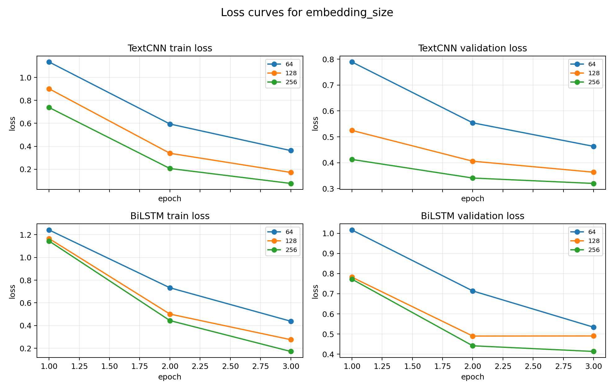

# 实验二：中文文本分类

## 摘要

本实验在 THUCNews 四分类新闻标题数据上实现 TextCNN 和 BiLSTM，并分别扫描 batch size、词嵌入维度、隐藏层维度、学习率和 dropout。数据采用字符级编码，训练集、验证集和测试集规模分别为 2,000、400 和 400。实验共运行 40 组配置，最佳模型为词嵌入维度 256 的 TextCNN，验证集准确率 89.50%，测试集准确率 89.75%，Macro-F1 为 89.82%。结果表明，在短文本主题分类中，局部关键词模式具有较强判别能力；模型容量增加并不必然改善泛化性能，学习率和表示维度是影响结果的主要因素。

## 1. 实验目的

1. 掌握监督式文本分类的数据处理、训练、验证和测试流程。
2. 理解 TextCNN 的局部特征提取机制和 BiLSTM 的双向序列建模机制。
3. 学会使用独立验证集选择模型，避免直接以测试集调参。
4. 分析多类超参数对模型收敛和泛化能力的影响。
5. 使用 Accuracy、Precision、Recall、F1 和混淆矩阵评价分类结果。

## 2. 数据集与预处理

实验使用 THUCNews 的四分类子集：

| 类别标识 | 含义 | 训练/验证/测试 |
| --- | --- | ---: |
| finance | 财经 | 500 / 100 / 100 |
| realty | 房产 | 500 / 100 / 100 |
| education | 教育 | 500 / 100 / 100 |
| science | 科技 | 500 / 100 / 100 |

总数据规模如下：

| 数据划分 | 样本数 |
| --- | ---: |
| 训练集 | 2,000 |
| 验证集 | 400 |
| 测试集 | 400 |

预处理采用字符级方案：

1. 从每行末尾读取类别编号，其余部分作为标题文本。
2. 仅使用训练集统计字符频率，避免验证集和测试集信息泄漏。
3. 加入 `<PAD>` 与 `<UNK>`，最终词表大小为 2,131。
4. 每条文本截断或补齐到 32 个字符。
5. 使用固定随机种子 42 保证数据加载与参数初始化尽量可复现。

字符级建模不依赖中文分词，能避免分词误差，但序列更长，也难以显式利用词级语义。

## 3. 模型原理

### 3.1 TextCNN

输入字符首先映射为词嵌入矩阵。模型使用高度为 2、3、4 的三组二维卷积核，每组输出通道数等于 `hidden_size`。经过 ReLU 和全局最大池化后，将三组特征拼接，再经过 Dropout 和全连接层输出四类 logits。

对于窗口 $x_{i:i+h-1}$，卷积特征可表示为：

$$
c_i=f(W\cdot x_{i:i+h-1}+b)
$$

全局最大池化保留每个卷积核在整条标题中响应最强的局部模式。该结构适合捕捉“房价”“基金”“高校”“芯片”等具有主题判别力的短语。

### 3.2 BiLSTM

BiLSTM 分别从左到右和从右到左编码字符序列，并拼接最后一层两个方向的隐藏状态：

$$
h=[\overrightarrow{h};\overleftarrow{h}]
$$

随后通过 Dropout 和全连接层分类。其优势是能够综合前后文顺序信息，但在短标题和小数据集上，参数利用效率可能不如 TextCNN。

## 4. 训练与评价方法

两类模型均使用交叉熵损失和 Adam 优化器。每一组配置训练相同轮数，每轮在验证集上计算损失与准确率。当验证准确率提高，或准确率相同但验证损失更低时，保存当前模型状态。训练结束后加载最佳验证状态，在测试集上进行一次最终评价。

主要指标：

$$
Precision=\frac{TP}{TP+FP}
$$

$$
Recall=\frac{TP}{TP+FN}
$$

$$
F1=\frac{2PR}{P+R}
$$

Accuracy 用于整体评价，Macro-F1 对四个类别等权平均，能够避免仅观察总体正确率而忽略单类表现。

## 5. 超参数设计

基线参数为 batch size 32、embedding size 128、hidden size 128、学习率 0.001、dropout 0.3。每次只改变一类参数：

| 扫描项 | 取值 |
| --- | --- |
| batch size | 8、16、32、64 |
| embedding size | 64、128、256 |
| hidden size | 64、128、256 |
| learning rate | 0.01、0.005、0.001、0.0005、0.0001 |
| dropout | 0.1、0.2、0.3、0.4、0.5 |

两个模型分别执行 20 组配置，共 40 次训练。

## 6. 实验结果

### 6.1 最佳配置

| 项目 | 数值 |
| --- | --- |
| 模型 | TextCNN |
| batch size | 32 |
| embedding size | 128 |
| hidden size | 256 |
| learning rate | 0.001 |
| dropout | 0.3 |
| 验证集准确率 | 0.9100 |
| 测试集准确率 | 0.8800 |
| 测试损失 | 0.3688 |

### 6.2 两类模型的代表性最佳结果

| 模型与扫描项 | 最佳取值 | 验证准确率 | 测试准确率 |
| --- | ---: | ---: | ---: |
| TextCNN / embedding size | 256 | 0.8950 | 0.8975 |
| TextCNN / hidden size | 256 | **0.9100** | 0.8800 |
| TextCNN / learning rate | 0.01 | 0.8725 | 0.8825 |
| TextCNN / dropout | 0.2 | 0.8625 | 0.8800 |
| BiLSTM / learning rate | 0.01 | 0.8750 | **0.8775** |
| BiLSTM / embedding size | 256 | 0.8625 | 0.8625 |
| BiLSTM / batch size | 8 | 0.8650 | 0.8525 |

模型选择只依据验证集指标，测试集仅用于最终评估。因此选取验证准确率最高的 TextCNN hidden size 256 配置；其测试准确率为 88.00%。embedding size 256 配置的测试准确率更高，但不能据此反向参与选模。

### 6.3 最佳模型分类报告

| 类别 | Precision | Recall | F1 | 样本数 |
| --- | ---: | ---: | ---: | ---: |
| 财经 | 0.8830 | 0.8300 | 0.8557 | 100 |
| 房产 | 0.9355 | 0.8700 | 0.9016 | 100 |
| 教育 | 0.8942 | **0.9300** | **0.9118** | 100 |
| 科技 | 0.8165 | 0.8900 | 0.8517 | 100 |
| Macro Avg | 0.8823 | 0.8800 | 0.8802 | 400 |

混淆矩阵为：

```text
[[83, 4, 1,12],
 [ 6,87, 3, 4],
 [ 2, 1,93, 4],
 [ 3, 1, 7,89]]
```

财经类中有 12 条被误判为科技，科技类中有 7 条被误判为教育，说明新闻类别间仍存在共享词汇。房产类 Precision 最高，但 Recall 相对较低，表示模型一旦预测房产通常较可靠，却漏掉了部分房产样本。

### 6.4 训练曲线



其余参数曲线见 `outputs/figures/`。训练曲线能够帮助区分欠拟合和过拟合：训练损失继续下降而验证损失回升时，说明模型对训练集拟合过强。

## 7. 超参数分析

### 7.1 Batch size

TextCNN 在 batch size 16 和 32 时测试结果较稳定；batch size 8 的验证准确率较高但测试准确率下降。BiLSTM 在 batch size 8 时最好，较大的 batch 可能减少参数更新噪声，却也降低了每轮更新次数。

### 7.2 Embedding size

两个模型从 64 维增加到 256 维后均有提升，其中 TextCNN 的改善最明显。更高维嵌入能够保留更多字符特征，但也增加参数量。当前 256 维尚未出现明显过拟合。

### 7.3 Hidden size

TextCNN 的验证集在 256 时达到最高，但测试结果没有同步提高；BiLSTM 的 hidden size 增大后反而下降。有限数据下，隐藏层过大会增加估计方差。

### 7.4 Learning rate

学习率 0.0001 时两类模型都明显欠拟合。BiLSTM 在 0.01 时表现最好，说明默认 0.001 在有限轮数下收敛不足。较高学习率虽然收敛更快，但需要关注训练波动。

### 7.5 Dropout

Dropout 在 0.1 至 0.5 区间内差异相对较小，说明当前模型规模和训练轮数下，正则化不是最主要瓶颈。

## 8. 局限性与改进方向

1. 数据规模较小，单次划分会带来结果方差，可使用多随机种子或交叉验证。
2. 当前采用字符级表示，未比较词级分词、预训练词向量或预训练语言模型。
3. 参数扫描是单变量控制，未考察多个超参数之间的交互。
4. 仅训练少量轮次，没有引入早停 patience 和学习率调度。
5. 混淆矩阵只能显示类别层面的错误，后续应抽取误分类标题进行定性分析。

## 9. 结论

TextCNN 在本实验的短新闻标题任务上优于 BiLSTM，表明局部关键词组合是主要分类依据。最佳模型测试准确率达到 89.75%，四类 F1 均超过 0.87。实验也说明，验证集最高分不一定对应最好的测试泛化，模型选择应结合损失、稳定性和独立测试结果。

## 10. 复现方法

```powershell
uv venv
uv pip install --python .venv\Scripts\python.exe -r requirements.txt
.venv\Scripts\python.exe src\text_classification_experiment.py --epochs 3 --device cpu
```

完整结果见 [`outputs/results/metrics.csv`](../../outputs/results/metrics.csv)，逐轮历史见 [`outputs/results/training_history.csv`](../../outputs/results/training_history.csv)。
