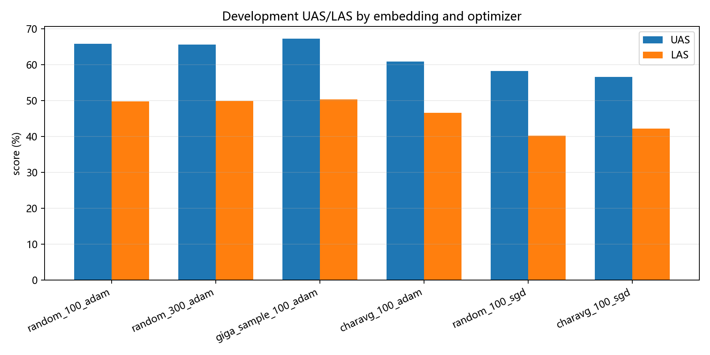

# 实验三：中文依存句法分析

## 摘要

本实验基于 THU 中文依存树库实现紧凑型 Biaffine Dependency Parser。模型将词向量与词性向量拼接后输入双向 LSTM，使用两组 MLP 构造 dependent/head 表示，再通过双仿射打分分别预测中心词和依存关系。实验比较随机词向量维度、预训练向量、字符平均向量以及 Adam/SGD 优化器。最佳配置为 100 维 Giga 预训练词向量与 Adam，开发集 UAS 为 67.24%，LAS 为 50.31%。实验表明，预训练词向量和优化器选择对小规模句法分析影响明显，而简单增大嵌入维度不能稳定提升性能。

## 1. 实验目的

1. 理解依存句法树、中心词和依存关系标签的定义。
2. 掌握 CoNLL 格式语料的读取和变长批处理方法。
3. 理解 BiLSTM 编码与 Biaffine 打分在依存分析中的作用。
4. 掌握 UAS、LAS 两项核心评价指标。
5. 比较不同词向量初始化和优化器对解析结果的影响。

## 2. 任务定义

给定词序列 $x_1,\ldots,x_n$，依存句法分析需要为每个词 $x_i$ 预测：

- 一个中心词位置 $h_i$，其中 0 表示人工加入的 ROOT；
- 一个依存关系标签 $r_i$。

所有预测弧应构成一棵以 ROOT 为根的有向依存树。本实验的紧凑实现直接对每个 dependent 选择得分最高的 head，没有额外运行全局 MST 解码，因此可能产生不满足严格树约束的局部预测，这也是结果上限的一个限制。

## 3. 数据处理

实验默认使用 THU 树库，读取 CoNLL 文件中的以下字段：

- 第 2 列：词；
- 第 4 列：词性；
- 第 7 列：中心词编号；
- 第 8 列：依存关系。

忽略多词 token 和空行，在句子边界处构造样本。实验使用 1,200 个训练句和 400 个开发句，每个 batch 包含 16 个句子。

词、词性和关系分别建立词表，并加入：

| 特殊符号 | 作用 |
| --- | --- |
| `<PAD>` | 变长序列补齐 |
| `<UNK>` | 未登录词或标签 |
| `<ROOT>` | 人工根节点 |

批处理时在每个句子开头加入 ROOT，并构造 mask 排除 padding 和 ROOT 本身。模型同时屏蔽词指向自身的弧。

## 4. 模型结构

### 4.1 输入表示

每个位置由词向量和 32 维词性向量拼接：

$$
e_i=[e_i^{word};e_i^{pos}]
$$

词向量维度根据实验配置取 100 或 300。

### 4.2 BiLSTM 编码器

拼接表示输入单层双向 LSTM，单向隐藏维度为 96，因此输出维度为 192。Dropout 为 0.25。

### 4.3 弧预测

编码结果分别通过 dependent MLP 和 head MLP，弧表示维度为 96。添加偏置项后采用双仿射打分：

$$
s_{ij}^{arc}=
\tilde h_i^{dep\top}W^{arc}\tilde h_j^{head}
$$

其中 $s_{ij}^{arc}$ 表示词 $i$ 选择词 $j$ 为中心词的得分。

### 4.4 关系预测

关系分支使用维度为 64 的 dependent/head 表示。训练时使用真实 head，评价时使用预测 head，并通过每个关系标签对应的双仿射参数计算关系得分。

### 4.5 损失函数

总损失为弧分类交叉熵与关系分类交叉熵之和：

$$
\mathcal L=\mathcal L_{arc}+\mathcal L_{rel}
$$

训练中将梯度范数裁剪到 5.0，降低梯度爆炸风险。模型按照开发集 LAS 保存最佳状态。

## 5. 评价指标

### 5.1 UAS

$$
UAS=\frac{\text{中心词预测正确的 token 数}}{\text{有效 token 总数}}
$$

UAS 只判断依存弧是否正确，不关心关系标签。

### 5.2 LAS

$$
LAS=\frac{\text{中心词和关系均正确的 token 数}}{\text{有效 token 总数}}
$$

LAS 条件更严格，通常低于 UAS。

## 6. 实验配置

公共参数：

| 参数 | 数值 |
| --- | ---: |
| 训练句数 | 1,200 |
| 开发句数 | 400 |
| 训练轮数 | 5 |
| batch size | 16 |
| BiLSTM 单向隐藏维度 | 96 |
| arc MLP 维度 | 96 |
| relation MLP 维度 | 64 |
| dropout | 0.25 |
| 随机种子 | 42 |

对比配置：

| 配置 | 词向量 | 优化器 |
| --- | --- | --- |
| random_100_adam | 随机 100 维 | Adam，lr=0.003 |
| random_300_adam | 随机 300 维 | Adam，lr=0.003 |
| giga_sample_100_adam | Giga 100 维精确匹配 | Adam，lr=0.003 |
| charavg_100_adam | 字符向量平均 | Adam，lr=0.003 |
| random_100_sgd | 随机 100 维 | SGD+momentum，lr=0.05 |
| charavg_100_sgd | 字符向量平均 | SGD+momentum，lr=0.05 |

## 7. 实验结果

| 配置 | 命中词数 | UAS | LAS | 耗时 |
| --- | ---: | ---: | ---: | ---: |
| random_100_adam | 0 | 0.6574 | 0.4979 | 11.05 s |
| random_300_adam | 0 | 0.6556 | 0.4991 | 12.86 s |
| giga_sample_100_adam | 83 | **0.6724** | **0.5031** | 11.00 s |
| charavg_100_adam | 2,717 | 0.6080 | 0.4658 | 10.79 s |
| random_100_sgd | 0 | 0.5818 | 0.4021 | 10.36 s |
| charavg_100_sgd | 2,717 | 0.5656 | 0.4216 | 10.07 s |



最佳配置相对 random_100_adam：

- UAS 提升约 1.50 个百分点；
- LAS 提升约 0.52 个百分点。

## 8. 样例分析

样例句为“世界第八大奇迹出现”。结果节选如下：

| 词 | Gold Head | Gold Relation | Pred Head | Pred Relation |
| --- | --- | --- | --- | --- |
| 世界 | 奇迹 | 限定 | 第 | 限定 |
| 第 | 大 | 限定 | 八 | 限定 |
| 八 | 第 | 连接依存 | 第 | 连接依存 |
| 大 | 奇迹 | 限定 | 奇迹 | 描述 |
| 奇迹 | 出现 | 存现体 | 出现 | 施事 |
| 出现 | ROOT | 核心成分 | ROOT | 核心成分 |

模型正确识别了句子根节点“出现”，也正确预测了部分局部结构，但对“第八大奇迹”内部的复杂修饰关系存在错误。尤其是“奇迹”的中心词预测正确而关系标签错误，这类情况会计入 UAS 正确但 LAS 错误，解释了两项指标之间较大的差距。

## 9. 结果讨论

### 9.1 预训练向量

Giga 文件只精确命中 83 个词，却获得最佳结果，说明少量高质量词级语义先验仍能改善模型初始化。字符平均方式覆盖 2,717 个词，但性能较低，表明覆盖率不是唯一决定因素。

### 9.2 字符平均表示

将词中字符向量直接平均忽略了字符顺序和组合语义。例如多字符词的整体含义不一定等于各字符含义的平均。字符向量来源与句法树库领域不匹配也可能降低效果。

### 9.3 向量维度

随机词向量从 100 维增加到 300 维后，UAS 略降，LAS 仅有极小提升，同时训练时间增加。小数据和少量 epoch 无法充分训练更高维参数。

### 9.4 优化器

Adam 明显优于 SGD。虽然 SGD 使用较高学习率和 momentum，但 5 个 epoch 内仍未充分收敛。更公平的比较需要分别调节学习率和训练轮数。

### 9.5 UAS 与 LAS 差距

最佳 UAS 为 67.24%，LAS 为 50.31%，相差约 16.93 个百分点。这说明中心词识别比关系分类容易，关系标签可能存在类别不均衡和细粒度边界模糊问题。

## 10. 局限性与改进方向

1. 只使用 1,200 个训练句，未利用完整树库。
2. 训练轮数仅 5，SGD 和高维模型可能尚未收敛。
3. 当前解码采用逐词 argmax，没有使用 MST 或 Eisner 算法保证全局树结构。
4. 未使用字符级编码器、预训练语言模型或更完整的词向量。
5. 未报告按依存关系类别划分的 F1，难以定位具体标签错误。
6. 可进一步加入长度分桶、学习率调度、早停和多随机种子实验。

## 11. 结论

本实验完成了一个端到端的 Biaffine 中文依存解析器。结果验证了词性信息、双向上下文和双仿射打分对结构预测的有效性。预训练词向量与 Adam 的组合表现最好，而简单增加词向量维度或提高字符覆盖率并不能保证性能提升。后续提升空间主要来自更大训练集、更充分训练和全局结构化解码。

## 12. 复现方法

```powershell
uv venv
uv pip install --python .venv\Scripts\python.exe -r requirements.txt
.venv\Scripts\python.exe src\dependency_parsing_experiment.py --epochs 5 --train-limit 1200 --dev-limit 400 --batch-size 16 --device cpu
```

详细指标见 [`outputs/results/metrics.csv`](../../outputs/results/metrics.csv)，样例解析见 [`outputs/results/sample_parse.txt`](../../outputs/results/sample_parse.txt)。
