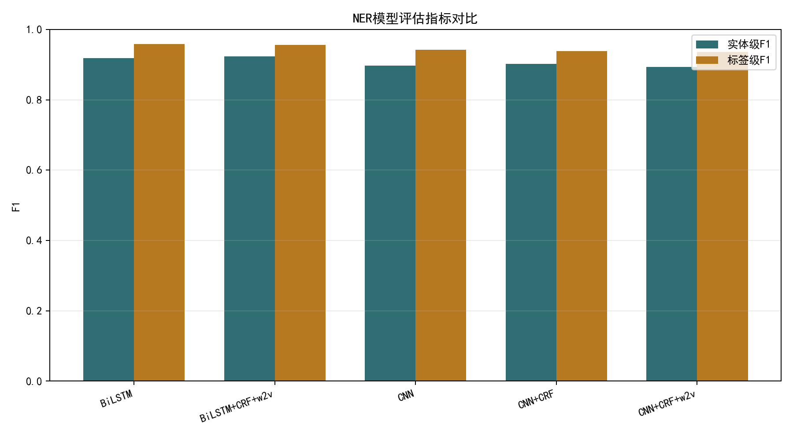

# 实验四：中文命名实体识别

## 摘要

本实验在 ResumeNER 中文简历数据集上比较 CNN、BiLSTM、CRF 和预训练词向量的组合效果。实验统一加载课程提供的五组模型 checkpoint，在相同测试集上计算标签级和严格实体级指标。结果显示，BiLSTM+CRF+w2v 的实体级 F1 最高，达到 0.9230；单独 BiLSTM 的 Precision 最高，为 0.9556，但 Recall 较低。实验说明双向上下文编码和 CRF 标签转移约束能够形成互补，而预训练词向量的收益取决于编码结构和训练状态，并非对所有模型都稳定有效。

## 1. 实验目的

1. 理解命名实体识别作为序列标注任务的输入、输出和评价方式。
2. 比较 CNN 与 BiLSTM 在局部特征和长距离上下文建模上的差异。
3. 理解 CRF 对标签转移合法性和全局序列解码的作用。
4. 分析预训练词向量对不同模型结构的影响。
5. 区分标签级指标与严格实体级指标。

## 2. 任务与数据集

ResumeNER 面向中文简历文本，采用字符级序列标注。标签集合包含实体的边界信息，实验统计到 10 个标签。主要实体类别包括：

- `NAME`：姓名类实体；
- `ORG`：组织机构类实体；
- `TITLE`：职位或职称类实体。

数据规模：

| 数据划分 | 句子数 | 字符数 | 平均长度 | 标签数 |
| --- | ---: | ---: | ---: | ---: |
| 训练集 | 3,821 | 124,099 | 32.48 | 10 |
| 验证集 | 463 | 13,890 | 30.00 | 10 |
| 测试集 | 477 | 15,100 | 31.66 | 10 |

词表大小为 1,906，预训练词向量维度为 100。实验使用课程参考代码构建词表、载入数据和执行模型解码，保证各 checkpoint 在一致的数据流程下比较。

## 3. 模型原理

### 3.1 CNN 序列编码

CNN 通过固定大小卷积窗口提取局部字符组合特征。其优势是计算并行度高、训练效率较好，适合识别依赖局部模式的实体边界；不足是单层局部卷积对长距离上下文建模有限。

### 3.2 BiLSTM 序列编码

BiLSTM 使用前向和后向 LSTM 同时编码上下文：

$$
h_t=[\overrightarrow{h_t};\overleftarrow{h_t}]
$$

当前字符的表示能够融合左侧与右侧信息，更适合根据完整上下文判断实体类别和边界。

### 3.3 CRF

普通分类层对每个位置独立预测标签，可能产生不合法序列，例如 `I-ORG` 直接出现在句首。CRF 在发射分数之外学习标签之间的转移分数，整条序列的得分可写为：

$$
S(x,y)=\sum_t P_{t,y_t}+\sum_t A_{y_{t-1},y_t}
$$

解码时使用动态规划寻找全局得分最高的标签序列。CRF 的主要作用不是增强文本编码，而是利用标签依赖约束输出边界更一致的序列。

### 3.4 预训练词向量

预训练向量为字符提供语义初始化，可能在小数据条件下提高泛化能力。但如果预训练语料与简历领域差异较大，或模型已经能够从监督数据中学习有效表示，增益可能有限。

## 4. 实验模型

| Checkpoint | 展示名称 | 编码器 | CRF | 预训练向量 |
| --- | --- | --- | --- | --- |
| `lstm.pkl` | BiLSTM | BiLSTM | 否 | 否 |
| `bilstm+CRF+w2v.pkl` | BiLSTM+CRF+w2v | BiLSTM | 是 | 是 |
| `cnn.pkl` | CNN | CNN | 否 | 否 |
| `cnn+CRF.pkl` | CNN+CRF | CNN | 是 | 否 |
| `cnn+CRF+w2v.pkl` | CNN+CRF+w2v | CNN | 是 | 是 |

本实验重点是统一评估已有 checkpoint，而不是重新训练。因此模型权重属于实验输入，保留在 `outputs/models/` 中。

## 5. 评价指标

### 5.1 标签级评价

逐字符比较预测标签与真实标签，并计算加权 Precision、Recall 和 F1。标签级指标对边界错误不够敏感：一个实体中大部分字符预测正确时，仍可能得到较高分。

### 5.2 实体级评价

只有实体的起止边界与类别全部正确，才计为正确实体。

$$
P=\frac{\text{正确实体数}}{\text{预测实体数}}
$$

$$
R=\frac{\text{正确实体数}}{\text{真实实体数}}
$$

$$
F1=\frac{2PR}{P+R}
$$

测试集中共有 1,437 个真实实体。实体级 F1 是本实验选择最佳模型的主要依据。

## 6. 实验结果

### 6.1 总体结果

| 模型 | 标签级 F1 | 实体 Precision | 实体 Recall | 实体 F1 |
| --- | ---: | ---: | ---: | ---: |
| BiLSTM | **0.9587** | **0.9556** | 0.8845 | 0.9187 |
| BiLSTM+CRF+w2v | 0.9567 | 0.9369 | **0.9095** | **0.9230** |
| CNN | 0.9418 | 0.9273 | 0.8699 | 0.8977 |
| CNN+CRF | 0.9388 | 0.9383 | 0.8678 | 0.9017 |
| CNN+CRF+w2v | 0.9361 | 0.9387 | 0.8525 | 0.8935 |



### 6.2 分实体类别结果

| 模型 | NAME F1 | ORG F1 | TITLE F1 |
| --- | ---: | ---: | ---: |
| BiLSTM | 0.8986 | 0.9072 | 0.9295 |
| BiLSTM+CRF+w2v | 0.9333 | **0.9093** | **0.9314** |
| CNN | **0.9910** | 0.8664 | 0.9056 |
| CNN+CRF | 0.9493 | 0.8519 | 0.9291 |
| CNN+CRF+w2v | 0.9282 | 0.8436 | 0.9232 |

CNN 在 NAME 类别上达到最高 F1，但在 ORG 和 TITLE 上相对较弱。姓名通常较短且具有明显局部字符模式，CNN 容易识别；组织机构名称更长、结构更多样，更依赖上下文和全局边界判断。

## 7. 结果分析

### 7.1 BiLSTM 与 CNN

BiLSTM 两组结果整体优于 CNN 系列，说明简历实体识别不仅依赖局部字符组合，还需要利用前后文。例如同一词语在“任职于”和“担任”之后可能分别对应机构和职位，双向上下文有助于消除歧义。

### 7.2 CRF 的作用

BiLSTM+CRF+w2v 相比 BiLSTM：

- Precision 从 0.9556 降至 0.9369；
- Recall 从 0.8845 提升至 0.9095；
- F1 从 0.9187 提升至 0.9230。

这说明加入 CRF 后模型预测更多完整实体，漏检减少，但同时增加了一些误检。最终 Recall 的收益超过 Precision 的损失。

CNN+CRF 相比 CNN 的 F1 从 0.8977 提升至 0.9017，增益较小。CRF 可以修正标签序列，但无法完全弥补编码器上下文能力不足。

### 7.3 预训练词向量

CNN+CRF+w2v 低于 CNN+CRF，说明预训练向量并非稳定增益。可能原因包括：

1. 预训练语料与简历领域存在偏差；
2. 词表覆盖有限或未登录字符较多；
3. checkpoint 的训练超参数不同，无法只归因于词向量；
4. 预训练向量可能限制模型适应当前数据分布。

### 7.4 标签级与实体级指标差异

所有模型标签级 F1 都高于实体级 F1。原因是实体级指标要求整个实体边界完全正确。例如一个 6 字机构名只错 1 个字符，标签级仍有 5 个位置正确，但实体级将整个实体判错。因此实体级指标更符合信息抽取的实际需求。

## 8. 误差来源

1. **实体边界模糊**：职位和组织机构可能包含修饰词，边界划分不稳定。
2. **长实体困难**：组织机构名称较长，局部模型容易漏掉前后缀。
3. **类别语义接近**：部分职位名称与组织部门名称在表面形式上相似。
4. **训练与评估代码兼容性**：CRF 模型需要扩展标签映射并加入起止标签，处理错误会直接影响结果。
5. **checkpoint 非统一训练**：当前比较基于已有模型，无法严格控制所有训练变量。

## 9. 局限性与改进方向

1. 应在同一训练脚本、相同随机种子和相同超参数预算下重新训练所有模型。
2. 增加按实体长度、类别和句子长度划分的误差统计。
3. 对典型假阳性和假阴性样例进行人工分析。
4. 比较字符级预训练语言模型，例如 BERT+CRF。
5. 使用多次运行的均值与标准差，减少单个 checkpoint 的偶然性。
6. 评估推理速度和模型大小，而不仅比较准确率。

## 10. 结论

BiLSTM+CRF+w2v 在严格实体级评价下获得最佳 F1 0.9230，说明双向上下文和全局标签约束的结合最适合当前简历数据。BiLSTM 单模型 Precision 更高，表现更保守；CNN 对短且局部特征明显的姓名实体表现突出，但对组织和职位实体较弱。实验进一步说明，标签级高分不代表实体抽取一定准确，实际 NER 评估应以实体级指标为主。

## 11. 复现方法

```powershell
uv venv
uv pip install --python .venv\Scripts\python.exe -r requirements.txt
.venv\Scripts\python.exe src\ner_experiment.py
```

完整结果见 [`outputs/results/ner_metrics.csv`](../../outputs/results/ner_metrics.csv)，数据统计见 [`outputs/results/dataset_stats.json`](../../outputs/results/dataset_stats.json)。
