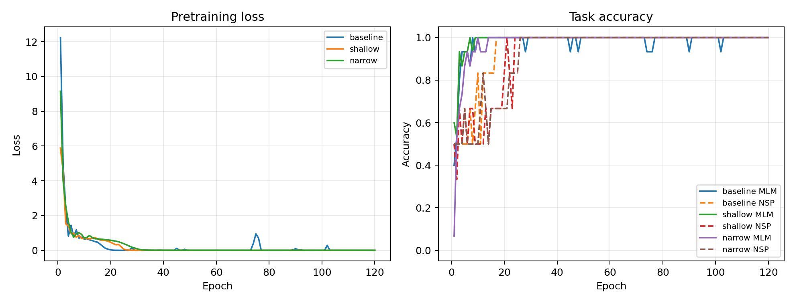
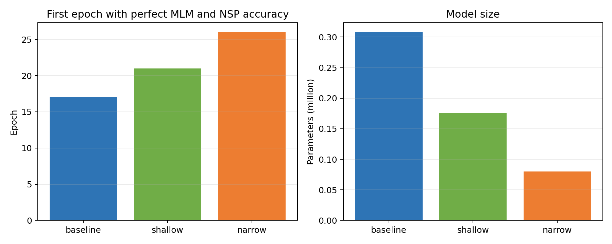

# 实验五：Mini-BERT 预训练

## 摘要

本实验使用 PyTorch 从零实现一个可在 CPU 上运行的简化 BERT，并联合训练掩码语言模型（MLM）和下一句预测（NSP）。模型包含 token、position、segment 三类嵌入，多头自注意力、前馈网络、残差连接与 LayerNorm，并在 MLM 输出层复用 token embedding 权重。实验比较基线、浅层和窄层三种配置。三组模型最终均在训练样本上达到 MLM 与 NSP 100% 准确率，基线模型最早在第 17 轮达到双任务满分，浅层模型耗时最短，窄层模型参数量最少。由于数据仅包含 9 个句子和 6 个预训练样本，结果主要验证实现正确性，不能代表真实预训练模型的泛化能力。

## 1. 实验目的

1. 理解 BERT 双向 Transformer Encoder 的核心结构。
2. 掌握 token、position 和 segment embedding 的组合方式。
3. 实现多头自注意力、残差连接、LayerNorm 和前馈网络。
4. 理解 MLM 的掩码策略和 NSP 的样本构造方法。
5. 比较模型深度和隐藏维度对参数量、耗时与收敛速度的影响。

## 2. 数据预处理

实验语料由 9 句英文对话组成。预处理包括：

1. 删除 `. , ? !` 等标点；
2. 转为小写；
3. 按空格切分；
4. 构建去重词表；
5. 加入 `[PAD]`、`[CLS]`、`[SEP]`、`[MASK]`。

最终词表大小为 40。

## 3. 预训练样本构造

### 3.1 NSP 样本

每条输入由句子 A 和句子 B 组成：

```text
[CLS] sentence A [SEP] sentence B [SEP]
```

若 B 是 A 在原始对话中的下一句，则 `is_next=1`，否则为 0。实验构造 6 个样本，其中正负样本各 3 个，避免类别不平衡。

### 3.2 Segment embedding

句子 A 及其特殊符号使用 segment 0，句子 B 使用 segment 1。Segment embedding 使模型能够区分两个句子片段。

### 3.3 MLM 掩码

从非特殊 token 中选择约 15% 作为预测目标，每条样本最多掩码 5 个位置。对选中的 token：

- 80% 替换为 `[MASK]`；
- 10% 替换为随机普通词；
- 10% 保持原词。

该策略减少预训练阶段和下游使用阶段之间的 `[MASK]` 分布差异。

### 3.4 补齐

输入最大长度为 30，不足部分用 `[PAD]` 补齐。MLM 目标位置也补齐到 5，损失函数通过 `ignore_index=0` 忽略无效目标。

## 4. 模型结构

### 4.1 输入嵌入

$$
E=E_{token}+E_{position}+E_{segment}
$$

三类嵌入相加后经过 LayerNorm 和 Dropout。

### 4.2 多头自注意力

每个注意力头计算：

$$
Attention(Q,K,V)=softmax\left(\frac{QK^\top}{\sqrt{d_k}}\right)V
$$

模型使用 4 个注意力头。代码对 `[PAD]` 位置施加 mask，避免无效 token 参与注意力分配。

### 4.3 Encoder Layer

每层由两部分组成：

1. 多头自注意力；
2. 两层前馈网络，激活函数为 GELU。

两个子层均使用残差连接和 LayerNorm：

$$
H'=LayerNorm(H+Attention(H))
$$

$$
H''=LayerNorm(H'+FFN(H'))
$$

### 4.4 NSP 输出头

取 `[CLS]` 位置表示，经线性层和 Tanh pooler 后，使用二分类层判断句子 B 是否为下一句。

### 4.5 MLM 输出头

从编码结果中收集被掩码位置，经 Linear、GELU、LayerNorm 和词表分类层预测原 token。解码层与 token embedding 共享权重，减少参数并保持输入输出表示一致。

## 5. 训练设置

| 参数 | 数值 |
| --- | ---: |
| batch size | 6 |
| 最大序列长度 | 30 |
| 最大掩码数 | 5 |
| 注意力头数 | 4 |
| dropout | 0.1 |
| 学习率 | 0.002 |
| 优化器 | AdamW |
| epoch | 120 |
| 随机种子 | 42 |
| 梯度裁剪 | 1.0 |

总损失为：

$$
\mathcal L=\mathcal L_{MLM}+\mathcal L_{NSP}
$$

每个 epoch 后在全部 6 个样本上计算损失和准确率，并记录 MLM、NSP 首次同时达到 100% 的轮次。

## 6. 对比配置

| 配置 | $d_{model}$ | Encoder 层数 | 头数 | $d_{ff}$ |
| --- | ---: | ---: | ---: | ---: |
| baseline | 128 | 2 | 4 | 256 |
| shallow | 128 | 1 | 4 | 256 |
| narrow | 64 | 2 | 4 | 128 |

浅层配置用于考察深度，窄层配置用于考察宽度与参数效率。

## 7. 实验结果

| 配置 | 参数量 | 耗时 | 首次双任务 100% | 最终总损失 | MLM Acc | NSP Acc |
| --- | ---: | ---: | ---: | ---: | ---: | ---: |
| baseline | 308,010 | 3.573 s | **17** | **0.000050** | 1.0000 | 1.0000 |
| shallow | 175,530 | **2.158 s** | 21 | 0.000281 | 1.0000 | 1.0000 |
| narrow | **80,298** | 2.616 s | 26 | 0.000344 | 1.0000 | 1.0000 |





### 7.1 参数量变化

浅层模型比基线减少 132,480 个参数，约下降 43.0%；窄层模型仅有基线约 26.1% 的参数。隐藏维度同时影响嵌入、Q/K/V 投影、前馈网络和输出层，因此缩小宽度带来的参数下降非常明显。

### 7.2 收敛速度

基线最早达到双任务满分，说明更大的表示容量有助于快速记忆当前小样本。浅层和窄层虽然最终也达到满分，但分别晚 4 和 9 个 epoch。

### 7.3 测试样例

基线模型输入：

```text
[CLS] hello romeo my name [MASK] juliet nice to meet you [SEP]
hello how are [MASK] [MASK] am romeo [SEP]
```

| 项目 | 真实值 | 预测值 |
| --- | --- | --- |
| 掩码词 1 | i | i |
| 掩码词 2 | you | you |
| 掩码词 3 | is | is |
| NSP | False | False |

末层注意力张量形状为 `[1, 4, 30, 30]`，分别对应 batch、注意力头、query 位置和 key 位置。

## 8. 结果分析

### 8.1 深度与宽度

减少 Encoder 层数能直接降低计算量，因此 shallow 耗时最短。narrow 参数最少，但耗时没有同比下降，原因包括固定框架开销、Python 调度开销和小 batch 下矩阵计算规模过小。

### 8.2 100% 准确率的含义

所有模型都在训练样本上达到满分，但数据只有 6 条。这说明模型成功拟合并验证了代码链路，不表示具有语言泛化能力。真实 BERT 预训练需要大规模语料、动态掩码和独立验证集。

### 8.3 MLM 与 NSP

MLM 迫使模型利用双向上下文恢复词语，NSP 则使用 `[CLS]` 表示判断句间关系。两类任务共享 Encoder，使模型同时学习 token 级和句子级信息。

### 8.4 权重共享

MLM decoder 与 token embedding 共享权重，在小模型中能明显减少参数，也符合 BERT 类模型常用设计。

## 9. 局限性与改进方向

1. 语料和词表极小，结果只能作为教学验证。
2. 训练集同时用于评价，缺少独立验证集和测试集。
3. 词元化仅按空格切分，没有 WordPiece 或 BPE。
4. NSP 负样本通过随机句对构造，任务过于简单。
5. 每种配置只运行一次，未报告随机种子方差。
6. 可增加注意力热力图，分析不同注意力头的关注模式。
7. 可使用动态 MLM，每轮重新选择掩码位置。
8. 可增加学习率 warmup、权重衰减和更真实的语料规模。

## 10. 结论

本实验完整实现了 Mini-BERT 的嵌入层、Transformer Encoder、MLM 和 NSP 双任务训练。基线模型参数最多、收敛最快；浅层模型训练最快；窄层模型参数效率最高。结果直观展示了模型容量与训练效率之间的权衡，同时也强调：小样本上的训练满分只能证明实现可用，不能代表通用语言理解能力。

## 11. 复现方法

```powershell
uv venv
uv pip install --python .venv\Scripts\python.exe -r requirements.txt
.venv\Scripts\python.exe src\bert_pretraining_experiment.py
```

快速检查：

```powershell
.venv\Scripts\python.exe src\bert_pretraining_experiment.py --quick
```

详细配置见 [`outputs/results/experiment_config.json`](../../outputs/results/experiment_config.json)，结果见 [`outputs/results/parameter_comparison.csv`](../../outputs/results/parameter_comparison.csv)。
