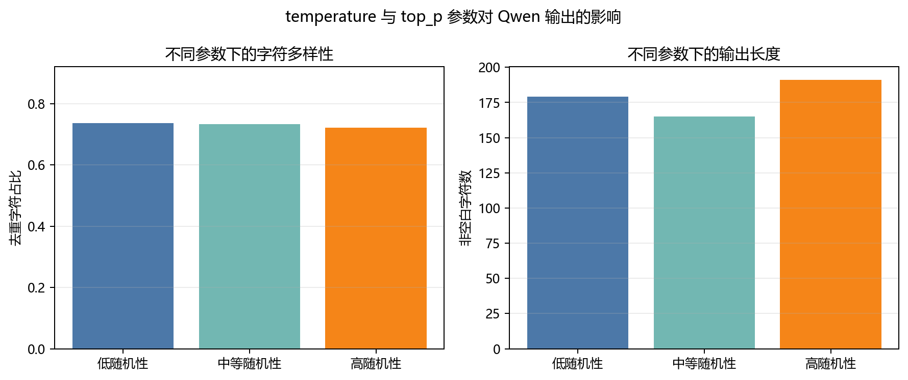

# 实验六：Qwen 大模型应用

## 摘要

本实验通过阿里云百炼的 OpenAI 兼容接口调用 `qwen-plus`，设计 12 次模型请求，覆盖 Prompt 优化、概念解释、情感分析、翻译、知识问答、Python 代码生成和采样参数比较。实验将原始 Prompt、生成结果、token 用量与耗时保存为结构化 JSON，并对生成代码实施分级验证：纯函数执行断言测试，含外部网络访问的脚本只做语法检查。结果表明，明确角色、事实边界、长度和输出格式能够显著减少无依据扩写；大模型生成的代码即使语法正确，也仍需要根据副作用和风险决定验证方式。单次 temperature/top_p 实验未呈现字符多样性随随机性单调上升的关系，说明生成质量评价需要多次采样和更合理的语义指标。

## 1. 实验目的

1. 掌握使用 OpenAI 兼容 SDK 调用 Qwen 模型的方法。
2. 理解 system prompt、user prompt 和采样参数的作用。
3. 比较宽泛 Prompt 与结构化 Prompt 的输出差异。
4. 测试大模型在多类自然语言任务中的通用能力。
5. 建立代码生成后的语法检查、执行测试和安全隔离流程。
6. 分析 temperature 与 top_p 对输出长度和多样性的影响。
7. 掌握 API 密钥的安全管理方法。

## 2. 系统设计

实验使用：

| 项目 | 配置 |
| --- | --- |
| 模型 | `qwen-plus` |
| 接口 | 阿里云百炼 OpenAI 兼容接口 |
| SDK | `openai` |
| 密钥来源 | 环境变量 `DASHSCOPE_API_KEY` |
| 请求方式 | Chat Completions |
| 成功请求数 | 12 |

每条响应保存以下信息：

- 任务编号；
- system/user prompt；
- temperature、top_p、max_tokens；
- 模型输出与 finish reason；
- 请求耗时；
- prompt、completion 和 total token 数。

密钥不写入代码、结果文件或报告，只在当前进程环境中读取。

## 3. Prompt 设计原则

实验将 Prompt 拆分为四类约束：

1. **角色约束**：例如“严谨的新闻编辑”“情感分析分类器”。
2. **事实约束**：明确只能依据输入，不补充未提供事实。
3. **格式约束**：指定 JSON、代码块、编号列表等结构。
4. **长度与内容约束**：限制字数、要求必备字段或测试用例。

结构化 Prompt 的目标不是让输入更长，而是降低任务歧义并提高输出的可验证性。

## 4. 实验任务

### 4.1 新闻摘要 Prompt 对比

宽泛版本只要求“总结新闻”；结构化版本要求：

- 只依据标题；
- 40 至 60 字；
- 包含主体、成果、量化效果和后续计划；
- 不使用标题党措辞。

### 4.2 多场景任务

| 任务 | 关键约束 |
| --- | --- |
| 概念解释 | 面向大学新生、180 字内、先类比后解释 |
| 情感分析 | 严格 JSON、证据字段、置信度 |
| 翻译 | 保持术语一致、不增加解释 |
| 知识问答 | 用三点比较训练、能力和部署成本 |

### 4.3 代码生成

生成三个 Python 任务：

1. Unicode 回文判断函数与 5 个断言；
2. 不使用第三方库的平均值函数；
3. 从公开 API 下载 JSON 并保存 CSV 的脚本。

### 4.4 参数对比

固定“雨后的校园”写作 Prompt，比较：

| 配置 | temperature | top_p |
| --- | ---: | ---: |
| low | 0.1 | 0.50 |
| medium | 0.7 | 0.80 |
| high | 1.2 | 0.95 |

## 5. 代码验证方法

程序先从 Markdown 代码块提取 Python 源码，再使用 `ast.parse` 检查语法。

对于无外部副作用的任务：

- 保存到独立文件；
- 以子进程执行；
- 设置 8 秒超时；
- 检查返回码、标准输出和标准错误；
- 依赖生成代码中的 assert 验证功能。

对于包含网络请求的脚本：

- 只做语法检查；
- 不在自动验证阶段访问外部服务；
- 报告中明确标注未执行。

这种分级策略避免将“能生成代码”误认为“代码可以安全运行”。

## 6. 实验结果

### 6.1 Prompt 优化

宽泛 Prompt 的输出加入了“多源观测数据”“高分辨率数值模型”“风暴潮协同模拟”等输入中没有提供的细节。虽然语言流畅，但存在事实扩写风险。

结构化 Prompt 输出：

> 中国科学家团队研发新型海洋预报系统，使台风路径预测误差降低约15%；该成果已通过验证，后续将在多个沿海城市开展应用试点。

该输出更短，覆盖主体、成果、量化效果和计划，整体更接近任务目标。不过“该成果已通过验证”仍不是原始标题明确给出的事实，说明 Prompt 约束只能降低幻觉风险，不能保证完全消除。

### 6.2 多场景任务

#### 概念解释

模型先使用灯的开关类比经典比特与量子比特，再解释叠加、测量和适用边界，基本满足结构要求。输出额外提及“纠缠”，虽属相关知识，但并非 Prompt 必需。

#### 情感分析

模型返回了可解析 JSON：

```json
{
  "label": "混合",
  "positive_evidence": ["功能很强", "客服处理问题倒是很及时"],
  "negative_evidence": ["启动太慢"],
  "confidence": 0.92
}
```

分类与证据对应正确，说明严格格式和字段约束适合下游程序消费。

#### 翻译

输出“高风险场景下仍需人工验证”，语义准确、无额外解释，符合技术文档风格。

#### 知识问答

模型从训练方式、能力范围和部署成本三方面完成比较，结构清晰。但回答中“大模型需 GPU 集群”“小模型参数为百万至千万级”等属于概括性描述，不能用于所有模型，实际使用时需要保留条件限定。

### 6.3 代码生成结果

| 任务 | 语法检查 | 实际执行 | 结果 |
| --- | --- | --- | --- |
| 回文函数 | 通过 | 是 | 断言通过，返回码 0 |
| 平均值函数 | 通过 | 是 | 断言通过，返回码 0 |
| API 转 CSV | 通过 | 否 | 含网络请求，仅静态检查 |

回文任务首次生成曾因 token 上限不足被截断，调整 `max_tokens` 后重新生成。这说明生成上限不仅影响回答长度，也可能导致代码结构不完整。

### 6.4 参数实验

| 配置 | temperature | top_p | completion tokens | 字符数 | 去重字符占比 | 重复字符占比 |
| --- | ---: | ---: | ---: | ---: | ---: | ---: |
| low | 0.1 | 0.50 | 158 | 179 | **0.7374** | 0.2626 |
| medium | 0.7 | 0.80 | 145 | 165 | 0.7333 | 0.2667 |
| high | 1.2 | 0.95 | 163 | **191** | 0.7225 | **0.2775** |



高随机性配置输出最长，但字符去重比例反而最低。该结果不表示提高 temperature 会降低创造性，而是说明单次输出的字符级统计噪声很大。

## 7. 参数原理与结果讨论

### 7.1 Temperature

模型首先产生 logits $z_i$，temperature $T$ 调整分布：

$$
P_i=\frac{\exp(z_i/T)}{\sum_j\exp(z_j/T)}
$$

较低 $T$ 使高概率 token 更突出，输出更稳定；较高 $T$ 使分布更平坦，增加低概率 token 被采样的机会。

### 7.2 Top-p

Top-p 从概率最高的 token 开始累积，保留累计概率达到阈值 $p$ 的最小集合，再从中采样。较小 top-p 限制候选范围，较大 top-p 保留更多可能性。

### 7.3 为什么结果不单调

1. 每组参数只采样一次；
2. 字符去重比例不能衡量语义新颖性；
3. 输出长度不同会影响比例；
4. Prompt 对内容和长度已有较强约束；
5. temperature 与 top-p 同时变化，无法分离单个参数的影响。

更严谨的实验应固定其中一个参数、每组重复 20 次以上，并使用 distinct-n、self-BLEU、语义嵌入距离和人工评价。

## 8. 安全性与工程考虑

1. **密钥管理**：只通过环境变量读取，不写入仓库。
2. **输出不可信**：模型返回文本应视为外部输入，解析 JSON 时需要异常处理和 schema 校验。
3. **代码执行隔离**：生成代码可能包含文件、网络、进程或系统命令，不能直接在主环境运行。
4. **超时与资源限制**：子进程应设置时间、内存和文件系统权限限制。
5. **事实核验**：摘要和问答中的事实应与输入或可靠来源比对。
6. **结果可追踪**：保存 Prompt、参数、模型名和 token 用量，便于复现实验。

## 9. 局限性与改进方向

1. 每项任务样本量很小，无法评价稳定性。
2. 未比较不同 Qwen 型号或其他厂商模型。
3. Prompt 优化主要依赖人工观察，缺少自动化评分标准。
4. 参数实验同时改变 temperature 和 top-p，变量控制不严格。
5. 代码测试依赖模型生成的 assert，测试本身也可能不充分。
6. 网络脚本未在受控沙箱中执行，未验证实际 HTTP 行为。
7. 后续可加入 JSON Schema、单元测试生成与人工测试分离、重试策略、速率限制和成本统计。

## 10. 结论

实验完成了 Qwen API 从请求构造、结果记录到代码验证的完整应用流程。结构化 Prompt 明显改善了输出的简洁性和可处理性，但仍不能完全消除无依据内容。代码生成必须与语法检查、测试和副作用隔离结合。采样参数会改变生成分布，但单次字符统计不足以对“创造性”下结论。可靠的大模型应用应将模型视为概率性组件，通过约束、验证、监控和人工复核构建完整系统。

## 11. 复现方法

```powershell
uv venv
uv pip install --python .venv\Scripts\python.exe -r requirements.txt
$env:DASHSCOPE_API_KEY = "your-api-key"
.venv\Scripts\python.exe src\qwen_application_experiment.py
```

只查看调用计划：

```powershell
.venv\Scripts\python.exe src\qwen_application_experiment.py --show-plan
```

原始响应见 [`outputs/results/qwen_responses.json`](../../outputs/results/qwen_responses.json)，参数对比见 [`outputs/results/parameter_comparison.csv`](../../outputs/results/parameter_comparison.csv)。
